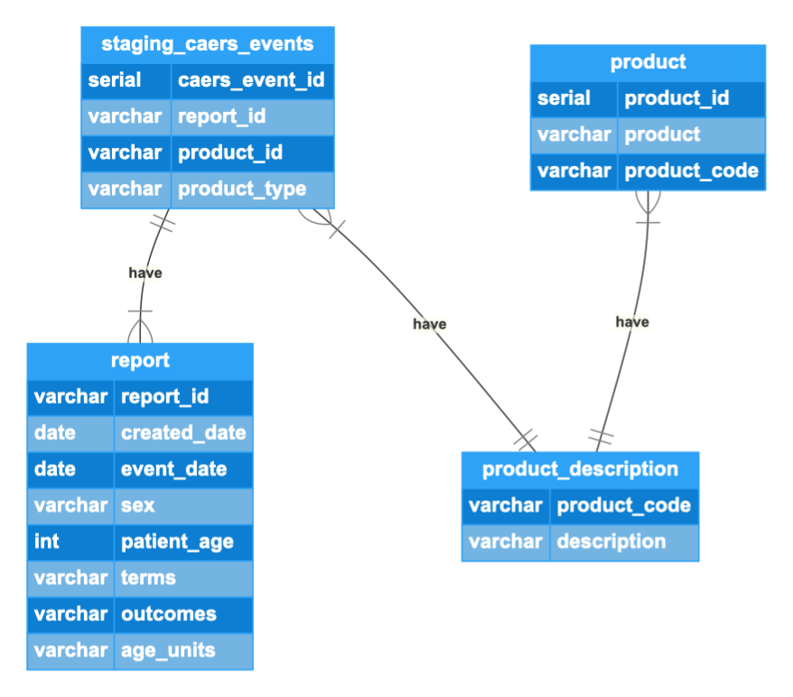

## Part 1: Create an ER Diagram by inspecting tables
* regions and region_areas have a ONE-TO-ONE relationship, because each row in region matches to each row in region_areas. 
* regions and continents have a {1..n} to {1} relationship, because each continent appears one or many times in the regions table, whereas each continent could only have 1 region in the continents table. 
* countries and regions have a {1..n} to {1} relationship, because each region appears only once for each country in the countries table, and multiple countries can have the same region in the same table. The region_id is a foreign key in countries, a primary key in regions. 
* languages and country_languages have a 1 to {1..n} relationship, as language_id is a primary key in languages, referenced as a foreign key in country_languages. For each language_id, there is at least one language in country_languages. 
    select distinct count(*) from country_languages (to get all unique languages)
* countries and country_languages have a 1 to {0..n} relationship, as country_id is a primary key in countries, referenced as a foreign key in country_languages. 
* country_stats and countries have a {0..n} to 1 relationship, as country_id is a primary key in countries, referenced as a foreign key in country_stats. Each country can have 0 to more stats. 

## Part 3
* 1. this query shows rows grouped by report id and its instances in the table, ordered by report_id instance count. From the result below we could tell each report_id is associated with multiple records. 

* 2. this query finds the most recent and least recent event date record. From the result below we could see the span of the whole data set. 

* 3. this query shows if each report id matches a patient. From the result below we could determine the relationship between report_id and patient. Each report_id accounts for one patient's records, and each record represents a product used by the patient.

* 4. this query determines whether the rows with the same terms will have the same outcomes. We could derive from the table below that there exists records with the same terms but different outcomes. 

* 5. this query explores the relationship between product codes and description. As shown, most product codes have a unique description, except for four of them which, taking a closer look, are actually the same content with a minor difference--whether a space is present before the content. 

* 6. these queries explore the relationship between created_date, event_date, and report_id. It is clear that the created_date, event_date are dependent on report_id. 

* 7. explores relationship between report_id, terms and outcomes. For each report_id, there is one term and one outcome.

## Part 3: Examine a data set and create a normalized data model to store the data

* by inspecting the staging_caers_event table we have as the 1st table, it is clear that many columns are dependent on report_id, which are seperated into a single table, report, the 2nd table. In addition, description is depending on product_code, which could be found in the No.5 query above, forming the 3rd table. Now, each product_code corresponds to a product category, whereas there're many products within the category. By giving an artificial key to each product, we would notice that product and product_code are dependent on the product artificial key, giving us the 4th table. 
* it is worth noting that product_id, as the primary key of the product_description table, is also the foreign key of the product table. Product_id, report_id in the product table, the report table respectively, are both foreign keys in the staging_caers_events table.
